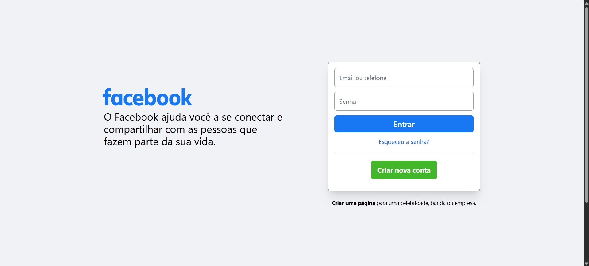

# 🔐 Clone da Página de Login do Facebook

Este projeto é um **clone da página de login do Facebook**, desenvolvido com o objetivo de **praticar a criação de interfaces modernas utilizando Tailwind CSS**.

O foco foi aplicar os conceitos de responsividade, organização visual, alinhamento preciso e uso eficiente das classes utilitárias do Tailwind, recriando a experiência visual da famosa tela de login do Facebook.

---

## 🧪 Tecnologias Utilizadas

- **HTML5**
- **Tailwind CSS**

> 💡 *Não foram utilizadas bibliotecas JavaScript ou frameworks neste projeto, pois o foco foi exclusivamente o layout com Tailwind.*

---

## 🎯 Objetivo

O principal objetivo deste projeto é **praticar o uso de Tailwind CSS** em um layout real, utilizando como referência a tela de login do Facebook.  

Durante o processo, foram treinadas habilidades como:

- Estruturação semântica com HTML5
- Responsividade com breakpoints do Tailwind
- Layout com Flexbox
- Cores, fontes e espaçamentos que se aproximam do visual original

---

## 📸 Prévia do Projeto

